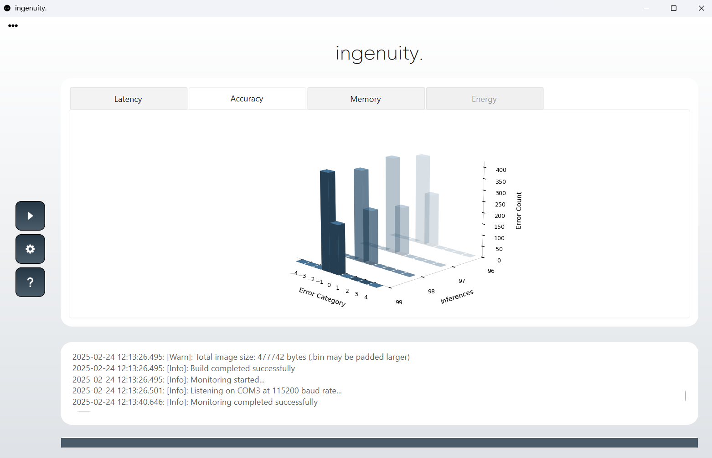

  

 
 

  

## Introduction
<b>Ingenuity</b> is an optimized inference engine and benchmarking tool for TinyML models on embedded IoT devices.

## Inference Engine
The inference engine is a lightweight, memory-efficient library. All buffers are pre-compiled, avoiding dynamic memory allocation, and it is optimized for high performance while maintaining a minimal, easy-to-use C API.

 

  

 

## Benchmarking
Benchmarking a quantized TFLite model typically involves multiple steps, including building and deploying the model on the device, as well as designing and implementing benchmarking test suites. Ingenuity automates this entire process with a single click, seamlessly bridging the gap between model quantization and benchmarking. Through the Graphical User Interface (GUI), benchmark metrics such as inference latency, memory usage, and quantization accuracy can be easily monitored within seconds. This allows users to benchmark their models quickly and efficiently.

## Supported hardware & ML models
The Ingenuity Inference Engine, along with the converted model, is implemented as an ESP-IDF component. It is optimized for performance and leverages the AI hardware accelerators of the ESP32-S3 microcontroller from Espressif. The entire component is stored in the internal memory of the microcontroller.

## Supported ML models
The Ingenuity Inference Engine supports quantized TensorFlow Lite models based on fully connected feed-forward neural networks.

<b>For more information, refer to the [Inference Engine](docs/Ingenuity_Inference_Engine.pdf). </b>

<b>For detailed instructions, refer to the [User's Manual](docs/Ingenuity_User's_Manual.pdf). </b>

## Directory structure
📂 <b>assets</b> – Misc images and files  
📂 <b>docs</b> – Documents  
📂 <b>esp32s3</b> – ESP-IDF template project  
📂 <b>examples</b> – Examples  
📂 <b>src</b> – Source code  

## Setup
Download the latest release (Ingenuity-v1.0.0.exe) and run it—no installation required.

## Contributing
For detailed guidelines on contributions, please check the [CONTRIBUTING.md](CONTRIBUTING.md) file.

## License  
This project is licensed under the **GNU General Public License v3.0**.  
See the [LICENSE](LICENSE) file for details.  

