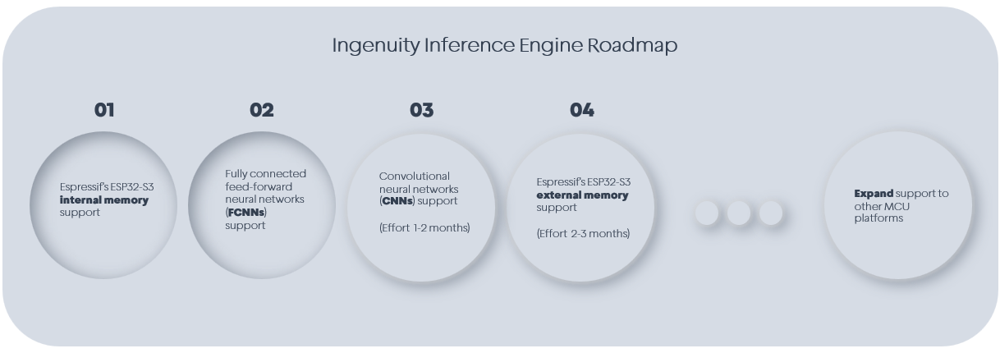

  

 
 

  

## Introduction
<b>Ingenuity</b> is an optimized inference engine and benchmarking tool for TinyML models on embedded IoT devices.

 

  

 

## Benchmark Tool
Benchmarking a quantized TFLite model typically involves multiple steps, including building and deploying the model on the device, as well as designing and implementing benchmarking test suites. Ingenuity automates this entire process with a single click, seamlessly bridging the gap between model quantization and benchmarking. Through the Graphical User Interface (GUI), benchmark metrics such as inference latency, memory usage, and quantization accuracy can be easily monitored within seconds. This allows users to benchmark their models quickly and efficiently.

<b>For more information and detailed instructions about the tool, refer to the [User's Manual](docs/Ingenuity_User's_Manual.pdf). </b>

## Inference Engine
The **Ingenuity Inference Engine** is a lightweight, memory-efficient, and high-performance library designed for running machine learning models on embedded devices.
A **TensorFlow Lite** (TFLite) model is first parsed and then converted into C buffer arrays. All buffers are **pre-compiled**, eliminating the need for dynamic memory allocation, and are optimized for high performance while maintaining a minimal, easy-to-use **C API** with no external dependencies.

It supports the **Precise Quad Re-Scaler Mechanism** (PQRM), a method designed for efficient, integer-only quantized inference with **100% rounding accuracy**.

The current implementation supports the **ESP32-S3** microcontroller from Espressif. The inference engine, along with the converted model, is implemented as an ESP-IDF component leveraging the AI hardware accelerators for optimized performance. The entire component is stored in the internal memory of the microcontroller, ensuring low-latency execution without external RAM.

The Ingenuity Inference Engine currently supports quantized TensorFlow Lite models based on **fully connected feed-forward** neural networks.

**Support for other microcontrollers and neural network architectures is planned as part of the roadmap**
  

### Demonstration

The following benchmark demonstrates the performance of the Ingenuity Inference Engine.
The evaluation is conducted against Espressif’s **esp-tflite-micro** engine under the same conditions: identical hardware, input data, and expected output.
The expected output is obtained from the **TensorFlow Lite Python interpreter**, which serves as a baseline since it performs inference without quantization-induced errors.

The pre-trained model used in this benchmark is from **MLPerf Tiny**, specifically the Deep Autoencoder for Anomaly Detection in machine operating sounds. It is a quantized INT8 model with integer-only input and output.

The latency for a single inference using Ingenuity is 276,554 cycles (1.728 ms), whereas with ESP-TFLite-Micro, it is 460,716 cycles (2.879 ms), both running at 160 MHz. This demonstrates a performance improvement of approximately **1.67x**

  

  

The total memory footprint is 611 bytes for Ingenuity and 21,360 bytes for ESP-TFLite-Micro, excluding the memory allocated for the model. This represents a **35.0x** reduction in memory usage.

  

  

The following histograms compare the output **accuracy** of the two inference engines relative to the **TensorFlow Lite Python Interpreter**, using a representative input with randomly generated values.
The x-axis shows the difference between the output of each tested inference engine and the reference output from the TFLite Python interpreter.

The **esp-tflite-micro** engine exhibits quantization errors primarily in the range of –2 to +1, with approximately **34%** of the outputs deviating from the expected result (219 out of 640), while the majority remain centered around 0. In contrast, the **Ingenuity** engine demonstrates zero deviation from the reference, achieving **100%** exact match across all predictions.

This result highlights the effectiveness of the PQRM method, which **eliminates rounding errors** and ensures fully accurate integer-only inference.

  

  

### C API Usage Example

 

  

 

## Directory structure
📂 <b>assets</b> – Misc images and files  
📂 <b>docs</b> – Documents  
📂 <b>esp32s3</b> – ESP-IDF template project  
📂 <b>examples</b> – Examples  
📂 <b>src</b> – Source code  

## Setup
Download the latest release (Ingenuity-v1.0.1.exe) and run it—no installation required.

## Roadmap
The following roadmap applies to the Ingenuity Inference Engine, not the benchmark tool.
 

  

 

## Contributing
Contributions to Ingenuity are welcome.
Please open an issue to propose features, report bugs, or discuss potential improvements before submitting a pull request.

If Ingenuity is already useful to you, please give it a ⭐ on GitHub. If the planned roadmap features could bring value to you or your company, consider becoming a sponsor to help bring them to life!

Thank you for your support! 
 

## License  
This project is licensed under the **GNU General Public License v3.0**.  
See the [LICENSE](LICENSE) file for details.  

