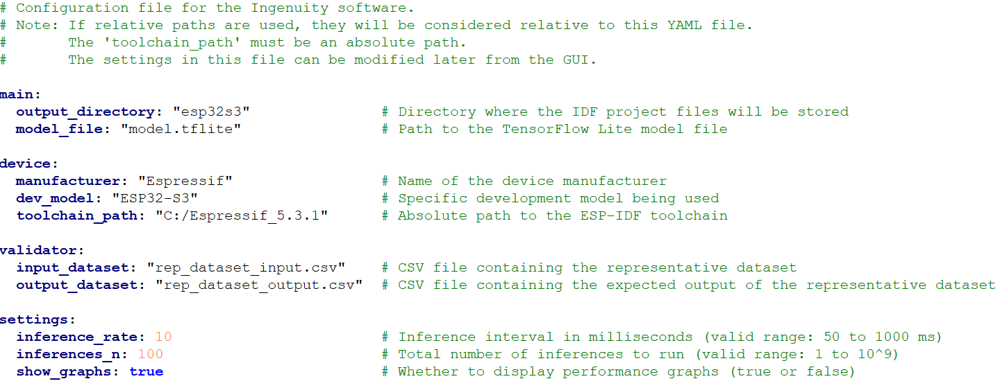

  

 
 
 

  

## Introduction
<b>Ingenuity</b> is designed to benchmark the inference performance of ML models on embedded
devices using its own inference engine.
Benchmarking a quantized TFLite model typically involves multiple steps, including building
and deploying the model on the device, as well as designing and implementing benchmarking
test suites. Ingenuity automates this entire process with a single click, seamlessly bridging the
gap between model quantization and benchmarking.
 
 
 

  

 
Through the Graphical User Interface (GUI), benchmark metrics such as inference latency,
memory usage, and quantization accuracy can be easily monitored within seconds. This allows
users to benchmark their models quickly and efficiently.

Before execution, the project file must be properly configured with the validator's input
and output representative datasets, as well as inference settings such as the
inference rate and the number of inferences for benchmarking. Once
configured, a single click automates the entire process—handling file
generation, project building, flashing, and real-time monitoring of benchmarking
results. After the benchmark is completed, the generated ESP-IDF project folder can be used to integrate
the benchmarking setup with the user’s application code.
 
 
 
## Getting-started

  
  The <b>Home</b> button allows you to create a new project or load an existing one. To create a new project, follow these steps:  
1. Click the Home button and select "New Project..."  
2. In the New Project window, choose the folder where the project will be created.  
3. Enter a name for the new project and click OK—this will open a file explorer window. 
4. Locate and open the .yaml file, then edit it with the appropriate parameters. 

 
 

  

 
 

  
  The <b>Execution</b> button starts the one-click benchmarking process. It becomes enabled after a project is loaded and consists of the following steps:  
1.	Generates the <b>ESP-IDF project</b>, including the Ingenuity inference engine library.  
2.	Creates the main C file and the validator files required for benchmarking.  
3.	Builds the project and flashes it to the device.  
4.	Monitors the device output and displays the benchmark results.  

 
 

  
  The <b>Settings</b> button opens the settings window, allowing you to configure benchmark parameters.  
<b>Note</b>: These parameters can also be modified directly in the project file before loading the project.

 
 
The <b>main panel</b> displays benchmark results for the following metrics:  
1.	<b>Latency</b> – Inference latency measured in MCU cycles.  
2.	<b>Accuracy</b> – Accuracy of the inference engine, calculated by comparing the actual output with the representative output dataset.  
3.	<b>Memory</b> –  
&nbsp;&nbsp; o	The first table shows the device's overall memory usage.  
&nbsp;&nbsp; o	The second table shows the inference engine’s memory usage as a separate component.  
4.	<b>Energy</b> – This feature is currently under development.  

## License  
This project is licensed under the **GNU General Public License v3.0**.  
See the [LICENSE](LICENSE) file for details.  

