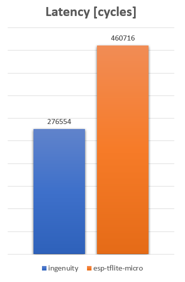
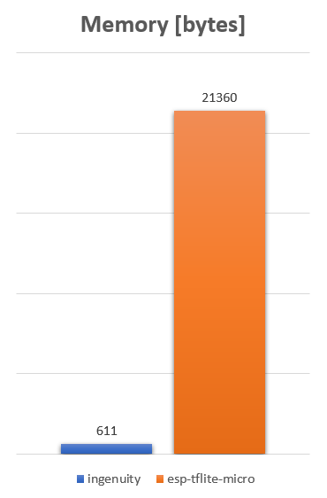
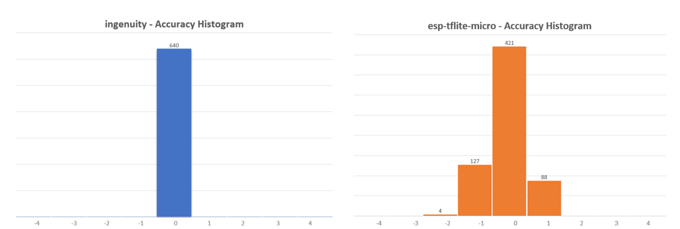
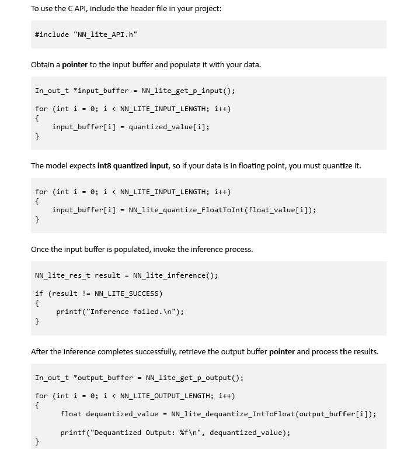

  

 
 

  

## Introduction
<b>Ingenuity</b> is an optimized inference engine and benchmarking tool for TinyML models on embedded IoT devices.

 

  

 

## Benchmark Tool
Benchmarking a quantized TFLite model typically involves multiple steps, including building and deploying the model on the device, as well as designing and implementing benchmarking test suites. Ingenuity automates this entire process with a single click, seamlessly bridging the gap between model quantization and benchmarking. Through the Graphical User Interface (GUI), benchmark metrics such as inference latency, memory usage, and quantization accuracy can be easily monitored within seconds. This allows users to benchmark their models quickly and efficiently.

<b>For more information and detailed instructions about the tool, refer to the [User's Manual](docs/Ingenuity_User's_Manual.pdf). </b>

## Inference Engine
The **Ingenuity Inference Engine** is a lightweight, memory-efficient, and high-performance library designed for running machine learning models on embedded devices.
A **TensorFlow Lite (TFLite) model** is first parsed using the tflite Python package and then converted into C buffer arrays. All buffers are **pre-compiled**, eliminating the need for dynamic memory allocation, and are optimized for high performance while maintaining a minimal, easy-to-use **C API** with no external dependencies.
  
The Ingenuity Inference Engine, along with the converted model, is implemented as an **ESP-IDF component**. It is optimized for performance and leverages the AI hardware accelerators of the **ESP32-S3** microcontroller from **Espressif**. The entire component is stored in the **internal memory** of the microcontroller, ensuring low-latency execution and efficient resource utilization. The Ingenuity Inference Engine supports quantized TensorFlow Lite models based on **fully connected feed-forward neural networks**.
  
The following benchmark serves as a demonstration and utilizes a pre-trained model from MLPerf Tiny, specifically the **Deep Autoencoder** for Anomaly Detection in machine operating sounds. The model is a quantized INT8 version with integer input and output. The comparison is conducted under identical conditions—using the same setup, hardware, input, and expected output (obtained from the TensorFlow Lite Python interpreter)—to evaluate the performance of the **Ingenuity Inference Engine** against Espressif’s **ESP-TFLite-Micro**. 
  
The latency for a single inference using Ingenuity is 276,554 cycles (1.728 ms), whereas with ESP-TFLite-Micro, it is 460,716 cycles (2.879 ms), both running at 160 MHz. This demonstrates a performance improvement of approximately **1.67x**

  

  

The total memory footprint is 611 bytes for Ingenuity and 21,360 bytes for ESP-TFLite-Micro, excluding the memory allocated for the model. This represents a **35.0x** reduction in memory usage.

  

  

The following histograms compare the accuracy of the two inference engines with the TFLite Python Interpreter, using an indicative input with random values. The x-axis represents the difference between the output and the expected output. 
  
We can see that the Ingenuity Inference Engine has **no errors** compared to the ESP-TFlite-Micro where the errors are mostly distributed between -1 and 1.

  

  

### C API Usage Example

 

  

 

## Directory structure
📂 <b>assets</b> – Misc images and files  
📂 <b>docs</b> – Documents  
📂 <b>esp32s3</b> – ESP-IDF template project  
📂 <b>examples</b> – Examples  
📂 <b>src</b> – Source code  

## Setup
Download the latest release (Ingenuity-v1.0.1.exe) and run it—no installation required.

## Contributing
For detailed guidelines on contributions, please check the [CONTRIBUTING.md](CONTRIBUTING.md) file.

## License  
This project is licensed under the **GNU General Public License v3.0**.  
See the [LICENSE](LICENSE) file for details.  

